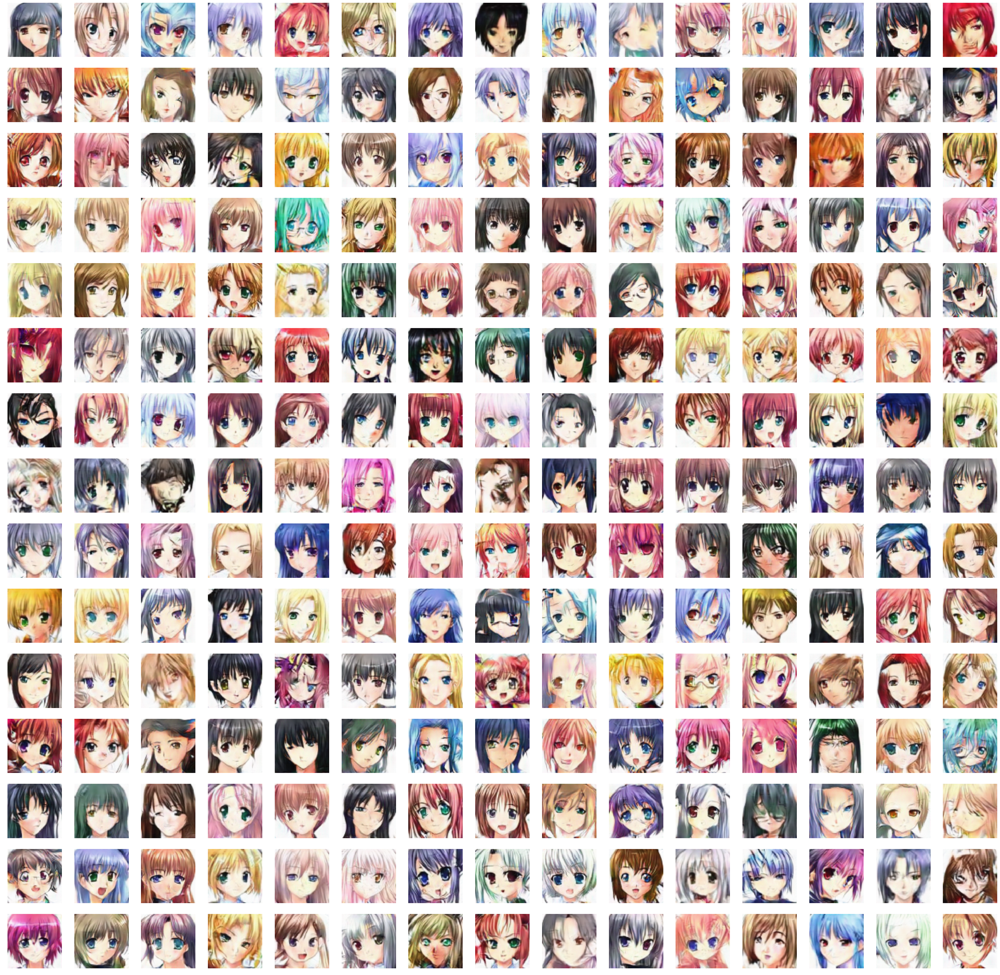

# GANja - Test bench for my GAN Experiments
This repo is a testbench for my immature GAN related experiments. I plan to implement and carefully understand various GAN related research papers.

### Generated images after 1500 epochs:

# About
- Dataset: [Anime girl faces](https://github.com/jayleicn/animeGAN) (weeb)
- `train.py` for training the model. Replace `load_path = "logs/models/1250.torch"` with the latest model to continue training. TODO: Take this from command line using argparse.
- `config.ini` contains all the hyperparameters and other training details.
- `networks.py` contain the Generator and Discriminator network classes.
- `load_data.py` is the dataloader.

# Todo (in order of priority):
- ~~Basic GAN~~
- ~~Historical weight averaging ([Tim et. al.](https://arxiv.org/abs/1606.03498))~~
- ~~TTUR (works surprisingly good) [Heusel et. al.](https://arxiv.org/abs/1706.08500)~~
- ~~Use config files~~
- ~~Latent walk~~
- ~~Train Time comparison~~
- ~~Load and save model for continuous training~~
- Current GAN for general size and not just 64x64 pixels
- Other GAN losses like WGAN, RaLSGAN
- New dataset and C-GANs
- Progressively growing GANs - ProGAN, BigGAN, StyleGAN
- More TODOs
- Add comments

# Latent walk examples:

# End notes
- Thank you to kaggle for organizing the [Generative Dog Images](https://www.kaggle.com/c/generative-dog-images/discussion) competition because of which I learned everything about GANs.

- http://www.thiswaifudoesnotexist.net/ wish I made this before them.

- No I dont smoke weed. I just like the PUN.

